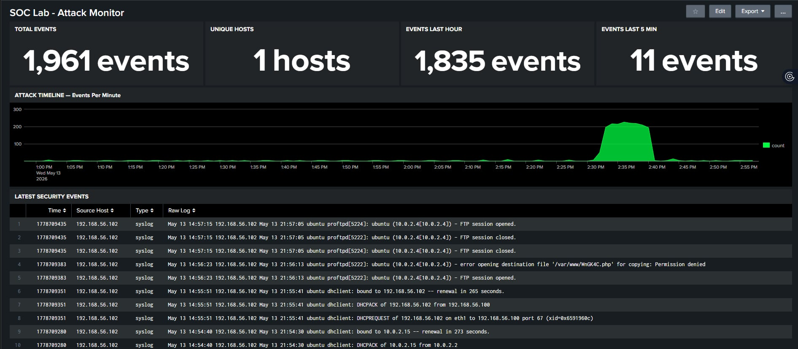

# 🔒 SIEM Home Lab — Attack Detection & Analysis

A home lab simulating real-world cyberattacks detected and logged by a Splunk Enterprise SIEM. Built to demonstrate core SOC analyst skills: log ingestion, threat detection, attack simulation, and incident documentation.

---

## 🧰 Lab Architecture

[Kali Linux] ──attacks──► [Metasploitable 3] ──rsyslog──► [Splunk SIEM]
10.0.2.4                    10.0.2.15                   Windows Host
(Attacker)                  (Victim)                    Port 514 UDP

All machines run on an isolated VirtualBox NAT Network — no traffic reaches the real internet.

---

## 🖥️ Environment

| Component | Details |
|---|---|
| Attacker | Kali Linux 2026.1 — 10.0.2.4 |
| Victim | Metasploitable 3 (Ubuntu 14.04) — 10.0.2.15 |
| SIEM | Splunk Enterprise (Windows Host) |
| Network | VirtualBox NatNetwork + Host-Only Adapter |
| Log Forwarding | rsyslog → UDP 514 → Splunk |

---

## ⚔️ Attacks Performed

### 1. Network Reconnaissance — Nmap Port Scan
- **Tool:** Nmap 7.98
- **Command:** `nmap -sS -sV 10.0.2.15`
- **Result:** 9 open ports discovered including FTP, SSH, HTTP, MySQL, IRC
- **SIEM Detection:** FTP and SSH connection attempts logged in Splunk

### 2. SSH Brute Force — Hydra
- **Tool:** Hydra
- **Command:** `hydra -l vagrant -P rockyou.txt ssh://10.0.2.15 -t 4`
- **Result:** Password cracked — `vagrant/vagrant` (default credentials)
- **SIEM Detection:** 1,830+ authentication events in one hour, peak 200+ events/min

### 3. Remote Code Execution — ProFTPD CVE
- **Tool:** Metasploit Framework 6.4
- **Module:** `exploit/unix/ftp/proftpd_modcopy_exec`
- **Vulnerability:** ProFTPD 1.3.5 mod_copy — unauthenticated file copy
- **Result:** Reverse shell obtained, uid=1000 with sudo group membership
- **SIEM Detection:** FTP sessions and PHP payload copy attempts logged

---

## 📊 Splunk SIEM Results

| Metric | Value |
|---|---|
| Total Events Captured | 1,961 |
| Attacks Detected | 3 / 3 |
| Peak Event Rate | 200+ per minute |
| Detection Rate | 100% |

---

## 🖼️ Screenshots

### Splunk Dashboard — Live Attack Monitor

---

## 📄 Incident Report

A full professional incident report documenting all findings, evidence, and remediation recommendations is included in this repository.

📎 [View Incident Report (PDF)](Incident_Report_Vishwa.pdf)

---

## 🛠️ Tools Used

- **VirtualBox** — Virtual machine hypervisor
- **Kali Linux** — Attacker machine
- **Metasploitable 3** — Intentionally vulnerable target
- **Splunk Enterprise** — SIEM / log analysis
- **Nmap** — Network reconnaissance
- **Hydra** — Brute force tool
- **Metasploit Framework** — Exploitation framework
- **rsyslog** — Log forwarding

---

## ⚠️ Disclaimer

This lab was built in a fully isolated virtual environment for educational purposes only. All attacks were performed against intentionally vulnerable systems I own and operate. Do not replicate against systems you do not own.

---

*Vishwa Prakash Choudhary | UC Davis B.S. Computer Science | 2026*
